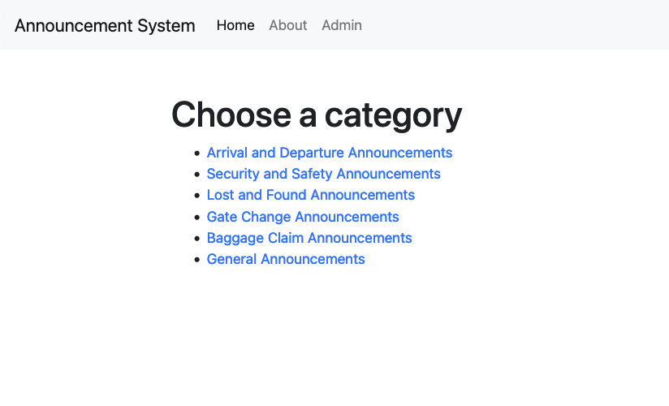
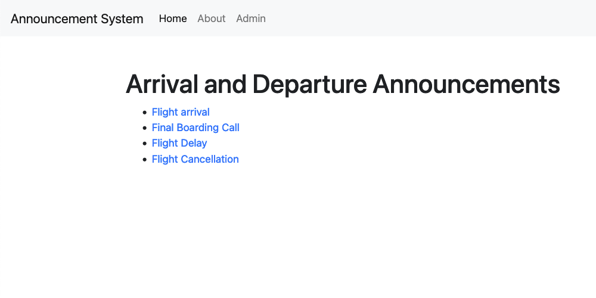
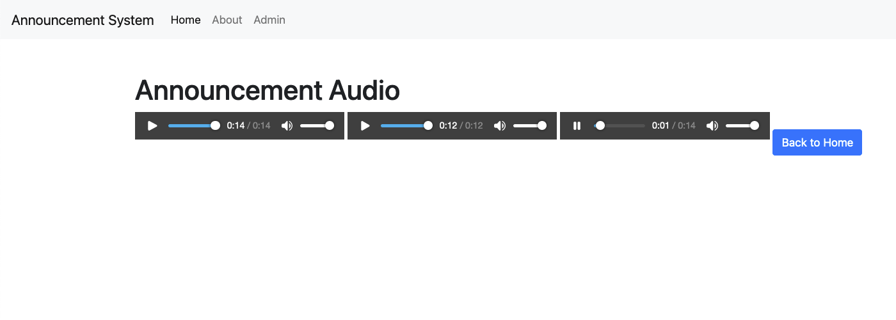
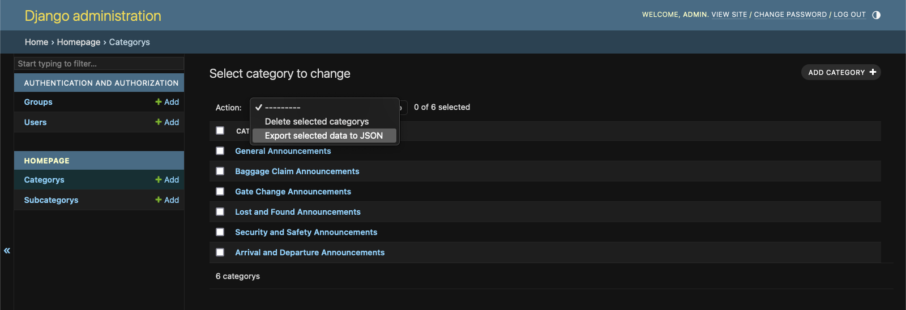

# Airport Announcement System

The Airport Announcement System is a Django web application that allows users to generate and broadcast announcements in multiple languages for an airport setting. Users can select from predefined categories and subcategories, fill in placeholders in announcement templates, and generate audio versions of the announcements using a text-to-speech (TTS) system.

## Table of Contents

- [Features](#features)
- [Installation](#installation)
- [Usage](#usage)
- [Project Structure](#project-structure)
- [Configuration](#configuration)
- [Screenshots](#screenshots)
- [Contributing](#contributing)
- [License](#license)

## Features

- User-friendly web interface for selecting announcement categories and subcategories
- Predefined announcement templates with placeholders for customization
- Support for multiple languages (English, Russian, Kyrgyz)
- Generation of audio announcements using a TTS system
- Admin interface for managing categories, subcategories, and announcement templates
- Automatic conversion of numbers to words in the selected language
- Logging of phonetic conversions for debugging purposes

## Installation

1. Clone the repository:

```
git clone https://github.com/AlexHamn/announcement-system.git
cd airport-announcement-system
```

2. Create and activate a virtual environment:

```
python -m venv venv
source venv/bin/activate
```

3. Install the required dependencies:

```
pipenv install
```

4. Apply database migrations:

```
python manage.py migrate
```

5. Load initial data (categories and subcategories):

```
python manage.py populate_data
```

6. Start the development server:

```
python manage.py runserver
```

7. Access the application in your web browser at `http://localhost:8000`.

## Usage

1. Select a category from the homepage.
2. Choose a subcategory from the list.
3. Fill in the placeholders in the announcement template.
4. Click the "Preview" button to see the generated announcements in different languages.
5. Confirm the announcement to generate audio versions.
6. Listen to the generated audio announcements.

## Project Structure

The project structure is as follows:

```
announcement-system/
├── announcement_system/
│   ├── settings.py
│   ├── urls.py
│   └── ...
├── homepage/
│   ├── models.py
│   ├── views.py
│   ├── forms.py
│   ├── management/
│   │   └── commands/
│   │       ├── populate_data.py
│   │       └── populate_data_test.py
│   └── ...
├── tts/
│   ├── models.py
│   ├── views.py
│   ├── utils.py
│   └── ...
├── templates/
│   ├── base.html
│   ├── homepage/
│   │   ├── index.html
│   │   ├── subcategory.html
│   │   ├── announcement.html
│   │   └── confirmation.html
│   └── tts/
│       └── audio.html
├── media/
│   └── ...
├── static_files/
│   └── ...
├── manage.py
└── ...
```

- The `announcement_system` directory contains the main Django project settings and URL configurations.
- The `homepage` app handles the user interface for selecting categories, subcategories, and filling in announcement templates.
- The `tts` app handles the generation of audio announcements using a TTS system.
- The `templates` directory contains the HTML templates for the project.
- The `media` directory stores the generated audio files.
- The `static_files` directory contains static assets such as CSS and JavaScript files.

## Configuration

The main configuration file is `announcement_system/settings.py`. You can modify the following settings:

- `SECRET_KEY`: Set a secure secret key for the Django project.
- `DEBUG`: Set to `False` in production.
- `ALLOWED_HOSTS`: Add the allowed hosts for the project.
- `DATABASES`: Configure the database settings.
- `MEDIA_ROOT` and `MEDIA_URL`: Set the paths for storing and serving media files.
- `STATIC_ROOT` and `STATIC_URL`: Set the paths for storing and serving static files.

## Screenshots


*Homepage with the list of categories*


*Subcategory page with the predefined announcement and form*


*Form*


*Confirmation page*


*Page displaying the three audio versions of the announcement*


*Admin interface for managing categories and subcategories*

## Contributing

Contributions to the Airport Announcement System project are welcome! If you find any issues or have suggestions for improvements, please open an issue or submit a pull request on the project's GitHub repository.

## License

This project is licensed under the [MIT License](LICENSE).